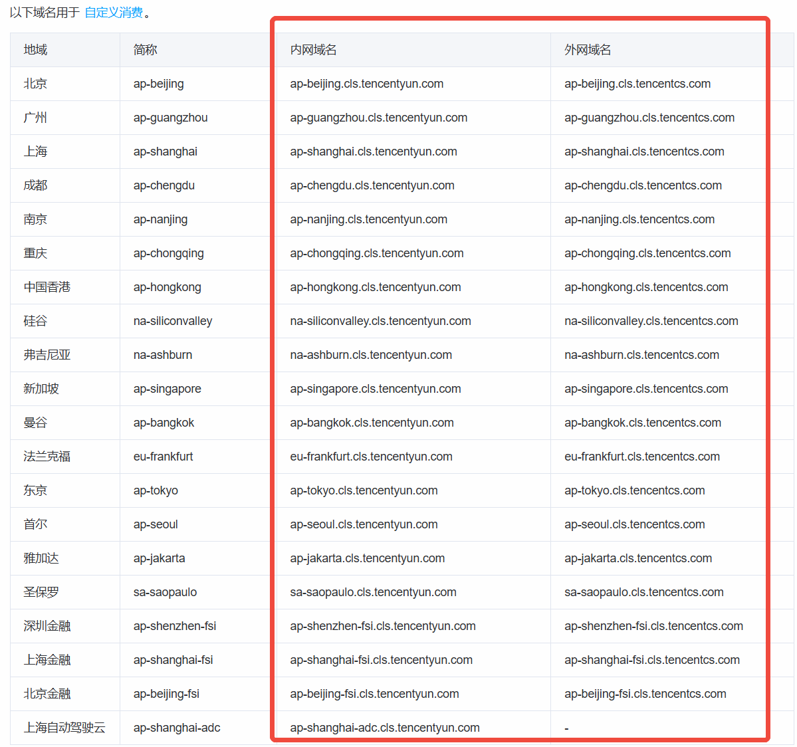

# 腾讯云 CLS Go SDK 消费端使用说明

本包 `github.com/tencentcloud/tencentcloud-cls-sdk-go/consumer` 提供基于「消费组（Consumer Group）」的高阶日志消费能力：自动消费组管理、心跳、分区分配、负载均衡、Offset 持久化、断点续传、优雅退出。你只需实现一个 `Processor` 接口即可完成日志消费业务逻辑。

---

## 一、能力概览

- **消费组管理**：自动创建 / 复用 / 更新 `ConsumerGroup`（`CreateConsumerGroup` 已存在时回退到 `UpdateConsumerGroup`）。
- **心跳与分区分配**：`HeartbeatWorker` 周期上报心跳，由服务端按 `PartitionStrategy=2` 做 rebalance，分区动态分配。
- **多分区并发消费**：每个分配到的 `(topicID, partitionID)` 启动一个 `PartitionConsumerWorker`，独立 goroutine 拉日志、调 `Processor.Process`。
- **Offset 自动持久化**：
  - 每条 `fetchData` 成功后内存 offset 立即推进；
  - 每轮主循环执行一次 60s 周期性 `FlushCheck` 兜底持久化（含空闲分区）；
  - 空闲（拉到 0 条）时每 30s 主动 `FlushOffset` 一次；
  - 优雅退出时强制 `FlushOffset(true)`，保证最后一批进度不丢。
- **断点续传**：启动时先按 `OffsetStartTime` 取消费组已提交 offset，没有则回退到 `begin`，再不行用 `0`。`InvalidOffset` 时自动切到 `end`。
- **智能停止**：配置 `OffsetEndTime` 时，所有分区都追上末尾后再过 `ConsumerGroupTimeout + HeartbeatInterval` 宽限期，整个 worker 自动 `Shutdown`。
- **优雅退出**：`Shutdown()` 取消 context → 停心跳 → 各分区 worker `close()`（`sync.Once` 保证 `Processor.Shutdown` 只跑一次） → flush 最终 offset。
- **VPC / 公网切换**：`ConsumerOption.Internal=true` 时，云 API 走 `cls.internal.tencentcloudapi.com`；`Region` 仍作为 `X-TC-Region` 请求头随每次请求发送。
- **运行统计**：`worker.GetStats()` 返回每分区与汇总的消费日志数 / 日志组数 / 当前 offset。

---

## 二、安装

```bash
go get github.com/tencentcloud/tencentcloud-cls-sdk-go
```

---

## 三、CLS Host

`ConsumerOption.Endpoint` 是日志消费（`PullLogs`）的接入域名，请参考 [可用地域](https://cloud.tencent.com/document/product/614/18940#.E5.9F.9F.E5.90.8D) 中 **日志消费 / 自定义消费** Tab 中的域名（也可以使用 `SetEndpointByRegionAndNetworkType` 通过地域 + 网络类型自动生成，如 Guangzhou + Extranet）。



> 注意：消费端域名（`*.cls.tencentcs.com` / `*.cls.tencentyun.com`）与云 API 域名（`cls.<region>.tencentcloudapi.com` / `cls.internal.tencentcloudapi.com`）不同。`Endpoint` 字段只填写消费域名；云 API 域名由 SDK 内部根据 `Region` 和 `Internal` 自动拼接，无需手动配置。

常用地域简称速查：

| 地域 | 简称 | 内网域名 | 外网域名 |
|---|---|---|---|
| 北京 | `ap-beijing` | `ap-beijing.cls.tencentyun.com` | `ap-beijing.cls.tencentcs.com` |
| 广州 | `ap-guangzhou` | `ap-guangzhou.cls.tencentyun.com` | `ap-guangzhou.cls.tencentcs.com` |
| 上海 | `ap-shanghai` | `ap-shanghai.cls.tencentyun.com` | `ap-shanghai.cls.tencentcs.com` |
| 成都 | `ap-chengdu` | `ap-chengdu.cls.tencentyun.com` | `ap-chengdu.cls.tencentcs.com` |
| 南京 | `ap-nanjing` | `ap-nanjing.cls.tencentyun.com` | `ap-nanjing.cls.tencentcs.com` |
| 重庆 | `ap-chongqing` | `ap-chongqing.cls.tencentyun.com` | `ap-chongqing.cls.tencentcs.com` |
| 中国香港 | `ap-hongkong` | `ap-hongkong.cls.tencentyun.com` | `ap-hongkong.cls.tencentcs.com` |
| 硅谷 | `na-siliconvalley` | `na-siliconvalley.cls.tencentyun.com` | `na-siliconvalley.cls.tencentcs.com` |
| 弗吉尼亚 | `na-ashburn` | `na-ashburn.cls.tencentyun.com` | `na-ashburn.cls.tencentcs.com` |
| 新加坡 | `ap-singapore` | `ap-singapore.cls.tencentyun.com` | `ap-singapore.cls.tencentcs.com` |
| 曼谷 | `ap-bangkok` | `ap-bangkok.cls.tencentyun.com` | `ap-bangkok.cls.tencentcs.com` |
| 法兰克福 | `eu-frankfurt` | `eu-frankfurt.cls.tencentyun.com` | `eu-frankfurt.cls.tencentcs.com` |
| 东京 | `ap-tokyo` | `ap-tokyo.cls.tencentyun.com` | `ap-tokyo.cls.tencentcs.com` |
| 首尔 | `ap-seoul` | `ap-seoul.cls.tencentyun.com` | `ap-seoul.cls.tencentcs.com` |
| 雅加达 | `ap-jakarta` | `ap-jakarta.cls.tencentyun.com` | `ap-jakarta.cls.tencentcs.com` |
| 圣保罗 | `sa-saopaulo` | `sa-saopaulo.cls.tencentyun.com` | `sa-saopaulo.cls.tencentcs.com` |
| 深圳金融 | `ap-shenzhen-fsi` | `ap-shenzhen-fsi.cls.tencentyun.com` | `ap-shenzhen-fsi.cls.tencentcs.com` |
| 上海金融 | `ap-shanghai-fsi` | `ap-shanghai-fsi.cls.tencentyun.com` | `ap-shanghai-fsi.cls.tencentcs.com` |
| 北京金融 | `ap-beijing-fsi` | `ap-beijing-fsi.cls.tencentyun.com` | `ap-beijing-fsi.cls.tencentcs.com` |
| 上海自动驾驶云 | `ap-shanghai-adc` | `ap-shanghai-adc.cls.tencentyun.com` | - |

---

## 四、密钥信息

`AccessKeyID` 和 `AccessKey` 为云 API 密钥，密钥信息获取请前往 [密钥获取](https://console.cloud.tencent.com/cam/capi)，并请确保密钥关联的账号具有相应的 [SDK 消费日志权限](https://cloud.tencent.com/document/product/614/68374)。

> 建议从环境变量 / CAM 角色读取，避免硬编码。如使用临时密钥，可在底层 `YunApiLogClient` 与 `PullLogsClient` 构造时传入 `SecurityToken`。

---

## 五、快速开始

### 1. 实现 `Processor`

接口定义（`consumer/processor.go`）：

```go
type Processor interface {
    Process(logs []*tencentcloud_cls_sdk_go.Log, tracker *OffsetTracker) (interface{}, error)
    Initialize(topicID string)
    Shutdown(tracker *OffsetTracker) error
    SaveOffset(tracker *OffsetTracker, force bool)
}
```

最简单的实现方式是 **嵌入 `*ProcessorBase`** 复用默认的 `Initialize / Shutdown / SaveOffset`，业务侧只写 `Process` 即可。下面是仓库内 `consumer/demo/consumer_demo.go` 的精简版（完整可运行示例见该文件）：

```go
type SampleProcessor struct {
    *consumer.ProcessorBase
}

func NewSampleProcessor() *SampleProcessor {
    return &SampleProcessor{ProcessorBase: consumer.NewProcessorBase()}
}

// Process 每次拉到一批日志后被调用。返回 error 仅会被记录，不会阻断后续消费。
// 切勿持有 logs 切片做跨调用异步处理：SDK 仅保证在 Process 返回前 slice 可用。
func (p *SampleProcessor) Process(
    logs []*tencentcloud_cls_sdk_go.Log,
    tracker *consumer.OffsetTracker,
) (interface{}, error) {
    log.Printf("Processing %d logs", len(logs))
    for _, item := range logs {
        log.Printf("time=%d, contents=%+v", item.Time, item.Contents)
    }
    // 提交 offset：force=false 走 ProcessorBase.OffsetTimeout(默认 3s) 节流
    p.SaveOffset(tracker, false)
    return nil, nil
}
```

### 2. 启动 ConsumerWorker

下面示例与 `consumer/demo/consumer_demo.go` 完全对齐：构造 `ConsumerOption` → `NewConsumerWorker` → `Run(ctx)` → 监听信号 → `cancel()` → 等待退出 → 可选 `DeleteConsumerGroup`。

```go
//go:build examples
// +build examples

package main

import (
    "context"
    "log"
    "os"
    "os/signal"
    "syscall"
    "time"

    "github.com/tencentcloud/tencentcloud-cls-sdk-go"
    "github.com/tencentcloud/tencentcloud-cls-sdk-go/consumer"
)

func main() {
    log.Println("=== CLS consumer demo ===")

    // ——— 用户参数，按实际替换 ———
    var (
        endpoint      = "ap-beijing.cls.tencentcs.com"
        secretID      = "Your_Secret_ID"
        secretKey     = "Your_Secret_Key"
        logsetID      = "Your_Logset_ID"
        TopicIDs      = []string{"Your_Topic_ID"} // 支持多 topic
        consumerGroup = "Your_Consumer_Group"
        consumerName  = "Your_Consumer_Name"      // 集群内唯一
        region        = "ap-beijing"
    )

    option := &consumer.ConsumerOption{
        Endpoint:             endpoint,
        AccessKeyID:          secretID,
        AccessKey:            secretKey,
        Region:               region,
        LogsetID:             logsetID,
        TopicIDs:             TopicIDs,
        ConsumerGroup:        consumerGroup,
        ConsumerName:         consumerName,
        HeartbeatInterval:    3,
        DataFetchInterval:    1,
        OffsetStartTime:      "begin", // 首次启动从最早开始
        MaxFetchLogGroupSize: 1000,    // 单次 PullLogs 返回的 LogGroup 上限
        OffsetEndTime:        "",      // 空 = 持续消费；非空 = 追上后自动退出
        ConsumerGroupTimeout: 20,
        StartTime:            int64(0),
        EndTime:              int64(0),
    }

    worker := consumer.NewConsumerWorker(option, NewSampleProcessor())

    ctx, cancel := context.WithCancel(context.Background())
    defer cancel()

    if err := worker.Run(ctx); err != nil {
        log.Fatalf("Failed to run consumer: %v", err)
    }
    log.Println("Consumer running successfully, press Ctrl+C to stop...")

    // ——— 每 10s 打印一次统计（可选） ———
    go func() {
        ticker := time.NewTicker(10 * time.Second)
        defer ticker.Stop()
        for {
            select {
            case <-ticker.C:
                stats := worker.GetStats()
                log.Printf("=== Consumer Statistics ===")
                log.Printf("Total partitions:        %v", stats["total_partitions"])
                log.Printf("Active partitions:       %v", stats["active_partitions"])
                log.Printf("Total logs consumed:     %v", stats["total_logs_consumed"])
                log.Printf("Total log groups:        %v", stats["total_log_groups_consumed"])
            case <-ctx.Done():
                return
            }
        }
    }()

    // ——— 等待退出信号 ———
    sigChan := make(chan os.Signal, 1)
    signal.Notify(sigChan, syscall.SIGINT, syscall.SIGTERM)
    select {
    case sig := <-sigChan:
        log.Printf("Received signal: %v, shutting down...", sig)
    case <-ctx.Done():
        log.Println("Context cancelled, shutting down...")
    }
    cancel()

    // ——— 留出时间让各分区 flush offset 后再退出 ———
    log.Println("Waiting for consumer to shutdown...")
    time.Sleep(5 * time.Second)

    finalStats := worker.GetStats()
    log.Printf("=== Final Statistics ===")
    log.Printf("Total logs consumed: %v", finalStats["total_logs_consumed"])

    // ——— （可选）删除消费组 ———
    // 会强制 Shutdown 当前 worker 并固定再等待 ~15s，最多重试 3 次。
    // 一般只在确认不再使用该消费组时调用，不应在每次进程退出时执行。
    if err := worker.DeleteConsumerGroup(); err != nil {
        log.Printf("Failed to delete consumer group: %v", err)
    } else {
        log.Printf("Consumer group %s deleted successfully", consumerGroup)
    }
}
```

### 3. 运行示例

仓库内 `consumer/demo/consumer_demo.go` 提供完整可运行示例。文件带 `//go:build examples` 构建标签，避免与项目正式构建里其他 `package main` 冲突，编译/运行时需要带 `-tags examples`：

```bash
# 进入 SDK 根目录
cd path/to/tencentcloud-cls-sdk-go

# 运行消费组完整示例（先把 demo 里 "Your_*" 占位符替换成真实参数）
go run -tags examples ./consumer/demo/consumer_demo.go
```

---

## 六、`ConsumerOption` 参数详解

| 字段 | 类型 | 必填 | 说明 |
|---|---|:--:|---|
| `Endpoint` | string | ✅ | `PullLogs` 接口域名，如 `ap-guangzhou.cls.tencentcs.com`，参考 [可用地域](https://cloud.tencent.com/document/product/614/18940) 中「API 上传日志」域名。 |
| `Region` | string | ✅ | 云 API 地域，写入 `X-TC-Region` 公共请求头。即使 `Internal=true` 也必须填，否则服务端会报 `MissingParameter: Region`。 |
| `Internal` | bool | | true 时云 API（消费组 / 心跳 / offset）走 `cls.internal.tencentcloudapi.com`，仅腾讯云 VPC 内可达。 |
| `AccessKeyID` / `AccessKey` | string | ✅ | 云 API 密钥；建议来自环境变量或 CAM 角色，避免硬编码。 |
| `LogsetID` | string | ✅ | 日志集 ID。 |
| `TopicIDs` | []string | ✅ | 要消费的 Topic ID 列表，可多个。 |
| `ConsumerGroup` | string | ✅ | 消费组名，不存在会自动创建；同 group 多实例共享分区。 |
| `ConsumerName` | string | ✅ | 当前消费实例名，集群内**唯一**。 |
| `HeartbeatInterval` | int | ✅ | 心跳间隔，秒。推荐 3~5。心跳同时承担分区分配同步。 |
| `DataFetchInterval` | int | ✅ | 主循环每轮基本节奏，秒。实际拉取节奏还会按 `lastFetchCount` 动态限速（500ms / 200ms / 50ms / 不限）。 |
| `ConsumerGroupTimeout` | int | ✅ | 消费组心跳超时，秒。心跳失败超过 `ConsumerGroupTimeout + HeartbeatInterval` 后，本地分区会被清空并等待重新分配。 |
| `MaxFetchLogGroupSize` | int | ✅ | 单次 `PullLogs` 拉取的 LogGroup 上限，常用 1000；越大吞吐越高，但内存占用越大。 |
| `OffsetStartTime` | string | ✅ | 首次启动且消费组无记录时的起始位点：`"begin"` / `"end"` / unix 时间戳字符串。**有消费组进度时此参数被忽略**。 |
| `OffsetEndTime` | string | | 结束位点（同 `OffsetStartTime` 取值）。设置后所有分区追上末尾且过宽限期自动 Shutdown；空表示持续消费。 |
| `StartTime` / `EndTime` | int64 | | Unix 秒，限定每次 `PullLogs` 的时间窗。`0` 表示不限制。 |

---

## 七、Processor 接口与 ProcessorBase

### 5.1 接口契约

```go
type Processor interface {
    Process(logs []*tencentcloud_cls_sdk_go.Log, tracker *OffsetTracker) (interface{}, error)
    Initialize(topicID string)
    Shutdown(tracker *OffsetTracker) error
    SaveOffset(tracker *OffsetTracker, force bool)
}
```

- `Initialize(topicID)`：分区 worker 启动时调用一次。
- `Process(logs, tracker)`：每批日志的核心处理函数。**串行**：同一分区不会并发调用；如果你直接复用同一个 Processor 实例给多分区，SDK 也会用一把 mutex 串行化。
- `Shutdown(tracker)`：分区 worker 关闭时调用一次（被 `sync.Once` 保护），通常用于最终持久化 offset。
- `SaveOffset(tracker, force)`：业务侧主动持久化 offset 的入口。

### 5.2 `ProcessorBase` 默认行为

`consumer.NewProcessorBase()` 提供：

- `Initialize(topicID)`：记录 `TopicID`。
- `Shutdown(tracker)`：日志一行 + `SaveOffset(tracker, true)` 强制持久化。
- `SaveOffset(tracker, force)`：
  - `force=true` 或距上次 > `OffsetTimeout`（默认 3s）：调用 `tracker.SaveOffset(true)` 触发持久化；
  - 否则只更新内存 offset。

### 5.3 兼容函数式 Processor

如果你已有一个 `func(topicID, partitionID, logs) interface{}` 形态的回调，可直接套 `ConsumerProcessorAdaptor`：

```go
adaptor := &consumer.ConsumerProcessorAdaptor{
    ProcessorBase: consumer.NewProcessorBase(),
    Func: func(topicID string, partitionID int, logs []*tencentcloud_cls_sdk_go.Log) interface{} {
        // ...
        return true // 返回 false 时本批不会触发自动 SaveOffset
    },
}
worker := consumer.NewConsumerWorker(opt, adaptor)
```

> ConsumerWorker 会对 `*ConsumerProcessorAdaptor` 类型做**分区级 clone**（每分区独立 `ProcessorBase`，避免 `TopicID/PartitionID` 字段被多分区互相覆盖）；自定义实现的 Processor 默认在多分区间共享，并由 `worker.ProcessorLock` 串行化 `Process`。

---

## 八、OffsetTracker 用法

`*consumer.OffsetTracker` 由分区 worker 创建并传入 `Process`，常用方法：

| 方法 | 说明 |
|---|---|
| `GetOffset()` | 当前内存中最新已拉取的下一 offset（`fetchData` 已自动推进） |
| `SetOffset(offset)` | 业务侧主动覆盖内存 offset（一般不需要） |
| `SaveOffset(persistent bool, offset ...int64)` | 写入 tempOffset；`persistent=true` 会立即 `FlushOffset(false)` |
| `FlushOffset(force bool)` | 把 tempOffset 提交到服务端；`force=true` 即使与上次相同也提交 |

**何时需要业务手动调？** 99% 场景不需要；默认机制（fetchData 自动推进 + 60s `FlushCheck` + 空闲 30s flush + 退出强制 flush）已足够。仅当你需要 **at-least-once → at-most-once 切换语义**（处理失败时不要推进）时，按需在 `Process` 中通过 `tracker.SetOffset` / 返回错误的方式控制。

---

## 九、运行时统计

```go
stats := worker.GetStats()
// {
//   "total_partitions": 4,
//   "active_partitions": 4,
//   "total_logs_consumed": 12345,
//   "total_log_groups_consumed": 256,
//   "partition_details": [...],
//   "consumer_group": "demo-group",
//   "consumer_name": "consumer-1",
//   "is_shutdown": false,
// }
```

`partition_details` 每项包含：`topic_id / partition_id / total_logs_consumed / total_log_groups_consumed / last_fetch_count / next_fetch_offset / is_shutdown`。

> `GetStats` 注释说明这是测试辅助，正式生产不建议高频调用。

---

## 十、生命周期与并发模型

```
NewConsumerWorker
   └─ Run(ctx)
        ├─ createConsumerGroup        // 首次 Create / 已存在则 Update
        ├─ HeartbeatWorker.Run        // 单独 goroutine：周期心跳 + 分区分配
        └─ go run()                   // 主循环 goroutine
              loop:
                ├─ heartbeat 拿到 held partitions
                ├─ 为每个新分区 getOrCreatePartitionWorker
                │     └─ go pw.ConsumeWithContext(ctx)
                │            loop:
                │              ├─ initialize（首次：取 offset）
                │              ├─ fetchData    （含动态限速 + 重试 + 空闲 30s flush）
                │              ├─ processData  （锁内调用 user.Process）
                │              ├─ FlushCheck   （60s 兜底持久化）
                │              └─ ctx 取消 → close()（sync.Once，强制 flush + user.Shutdown）
                ├─ cleanupUnusedPartitionWorkers   // 心跳后被移除的分区做 ShutDown
                ├─ needStop?（OffsetEndTime 模式）→ Shutdown
                └─ sleep DataFetchInterval
```

**并发要点**：
- 一个 `(topic, partition)` 只会有一个 `ConsumeWithContext` goroutine（`running` 原子 CAS 防并发）。
- 多个分区共享同一个用户 `Processor` 实例时，`Process` 会被 `worker.ProcessorLock` 串行化。
- `LogList` 每批 `make` 新底层数组，**不会**因复用导致下一批覆盖上一批数据；但如果你跨 `Process` 调用异步持有该 slice，仍建议自行深拷贝。

---

## 十一、错误处理与重试

| 场景 | SDK 行为 |
|---|---|
| `PullLogs` 网络错或服务端错 | 最多重试 3 次，每次退避 1/2/3s；仍失败本轮返回空数据，等下一轮 |
| `PullLogs` 返回 `InvalidOffset` | 自动 `GetOffsets(..., "end")` 取最新 offset 后重试 |
| 心跳失败 < `ConsumerGroupTimeout + HeartbeatInterval` | 保持当前分区，继续重试 |
| 心跳失败 ≥ 超时阈值 | 自动清空本地持有分区，等待重新分配 |
| `Process` 返回 error 或 panic | 仅记日志，**不影响 offset 推进**（offset 已在 fetchData 中前进）。如需"失败不推进"，请在 `Process` 内 `tracker.SetOffset(旧 offset)` 并 `return err` |
| 云 API `InternalError / Timeout / SpeedQuotaExceed` | 底层 `DoRequest` 最多重试 10 次（1s 退避） |
| `CreateConsumerGroup` 返回 "already exists" | 自动改走 `UpdateConsumerGroup` |

---

## 十二、最佳实践

1. **`ConsumerName` 用 hostname + 进程标识**，避免重启后心跳冲突。
2. **不要在 `Process` 内做长耗时同步操作**：会阻塞分区主循环、拖慢 offset 推进。耗时 IO 请走异步队列 + 自己控反压。
3. **持有 logs 跨调用前先深拷贝**：SDK 每批新分配底层数组，但语义上仅保证 `Process` 返回前可用。
4. **VPC 部署**：`Internal=true` 同时仍要填 `Region`。`Endpoint` 也要换成内网域名 `ap-xxx.cls.tencentyun.com`。
5. **优雅退出**：先 `cancel()` 让分区 worker 正常 flush，再 `worker.Shutdown()`；预留至少 5~10s 关闭窗口。
6. **不要每次进程退出都 `DeleteConsumerGroup`**：消费组是跨实例共享的状态，删了会清掉所有 offset。
7. **多实例横向扩容**：同 `ConsumerGroup` + 不同 `ConsumerName` 启动多个实例，服务端会按 `PartitionStrategy=2` 自动均衡分区。
8. **OffsetEndTime 一次性任务**：配置后所有分区追上 + 宽限期后自动退出，无需自己判断。

---

## 十三、FAQ

**Q1：`Process` 抛 panic 会怎样？**
A：`processData` 内有 `defer recover()`，仅记录日志，offset 仍会推进。如需"失败不推进"，请见第九节。

**Q2：能保证 exactly-once 吗？**
A：默认是 **at-least-once**。SDK 在 `fetchData` 成功后就推进了内存 offset，`Process` 失败不会回滚。要做 exactly-once，请配合业务侧的幂等键（如下游写库带 `(topic, partition, offset)` 唯一约束）。

**Q3：分区被重新分配时，正在 `Process` 的批次会怎样？**
A：被收回的分区 worker 会进入 `close()`，等当前 `Process` 调用归还 `processorLock` 后再走 `Processor.Shutdown` 并 flush。下一个拿到该分区的实例从已提交 offset 继续。

**Q4：多个 ConsumerName 重名会怎样？**
A：服务端不区分实例，心跳会互相抢分区，导致频繁 rebalance。请确保 `ConsumerName` 集群内唯一。

**Q5：如何只消费"最新"数据？**
A：`OffsetStartTime = "end"`，且消费组**首次创建**。如果消费组已存在并有进度，SDK 会优先用已提交 offset。可先 `DeleteConsumerGroup` 再启动，或换一个新的 `ConsumerGroup` 名字。

---

## 十四、相关源码索引

| 文件 | 职责 |
|---|---|
| `consumer/worker.go` | `ConsumerWorker`：主循环、分区 worker 管理、智能停止、优雅退出 |
| `consumer/heartbeat_worker.go` | 心跳循环 + 分区分配同步 |
| `consumer/partition_worker.go` | 单分区拉取 + processData + offset 推进 |
| `consumer/offset_tracker.go` | `OffsetTracker`：内存 offset / tempOffset / 持久化与 FlushCheck |
| `consumer/processor.go` | `Processor` 接口、`ProcessorBase`、`ConsumerProcessorAdaptor` |
| `consumer/consumer_client.go` | `ConsumerClient`：消费组 / 心跳 / offset 的内部封装（不建议直接使用） |
| `consumer/demo/consumer_demo.go` | 可运行的消费组完整示例（`-tags examples`） |
